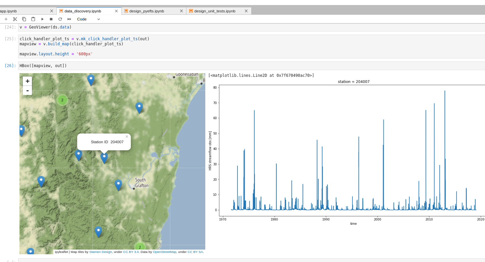

# efts_vis documentation

[](https://github.com/csiro-hydroinformatics/efts-python/blob/master/LICENSE.txt)  

<!-- master: [](https://ci.appveyor.com/project/jmp75/efts-python/branch/master) testing: [](https://ci.appveyor.com/project/jmp75/efts-python/branch/testing) -->



A package for the initial interactive discovery of geolocated xarray datasets. Primarily driven by the need to view [NetCDF for Water Forecasting Conventions v2.0](https://github.com/csiro-hydroinformatics/efts/blob/master/docs/netcdf_for_water_forecasting.md), but this could be made of more generic use.

## License

MIT (see [License.txt](https://github.com/csiro-hydroinformatics/efts-python/blob/master/LICENSE.txt))

## Source code

The code repository is on [GitHub](https://github.com/csiro-hydroinformatics/efts-python).

## Installation

```sh
pip install efts_vis
```

From source:

```sh
pip install -r requirements.txt
python setup.py install
```

## Sample use

Placeholder